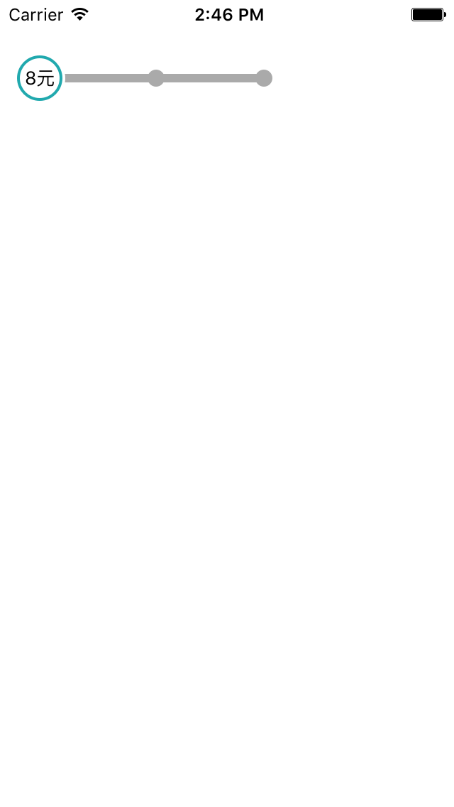

# DMLSegmentedControl

[](http://cocoapods.org/pods/DMLSegmentedControl)
[](http://cocoapods.org/pods/DMLSegmentedControl)
[](http://cocoapods.org/pods/DMLSegmentedControl)



## Example

To run the example project, clone the repo, and run `pod install` from the Example directory first.

## Requirements

* iOS 8.0+
* ARC

## Installation

DMLSegmentedControl is available through [CocoaPods](http://cocoapods.org). To install
it, simply add the following line to your Podfile:

```ruby
pod "DMLSegmentedControl"
```

## Author

Meiliang Dong, dongmeilianghy@sina.com

## License

DMLSegmentedControl is available under the MIT license. See the LICENSE file for more info.
